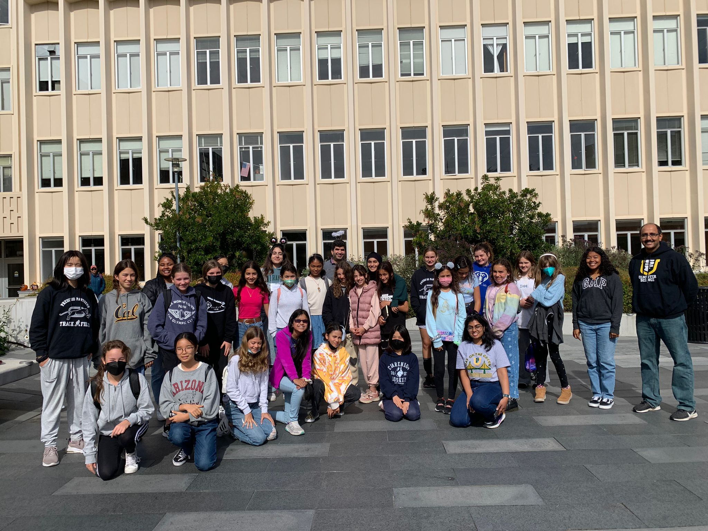
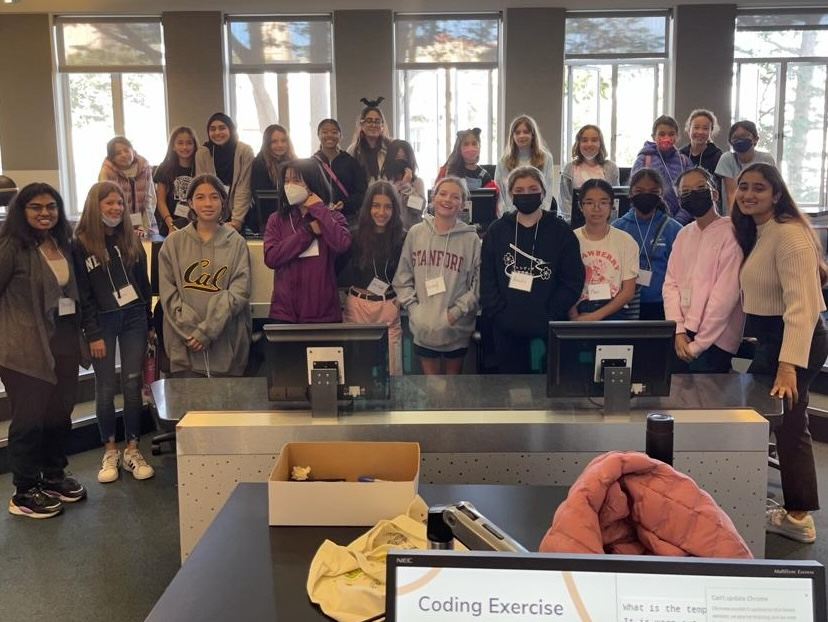
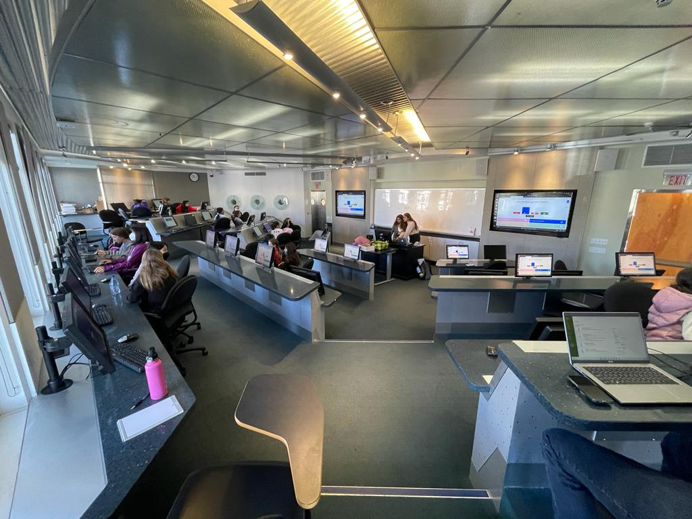
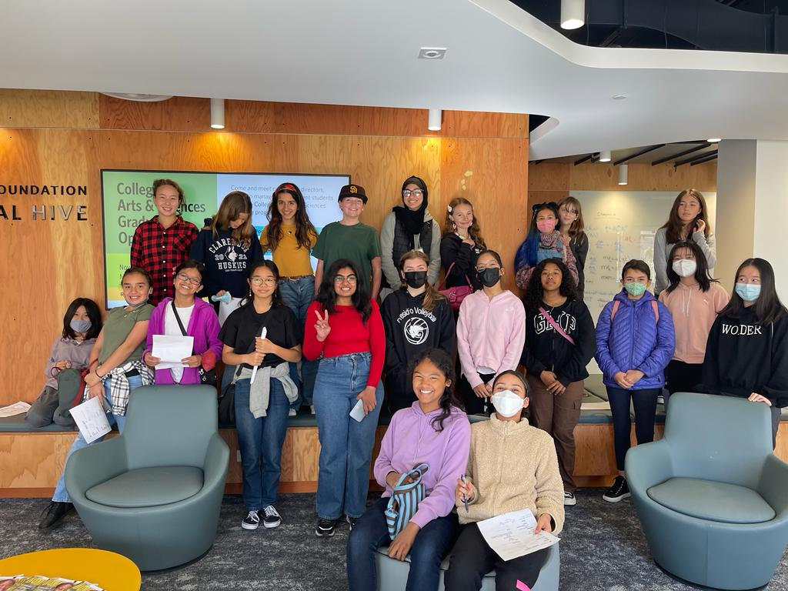
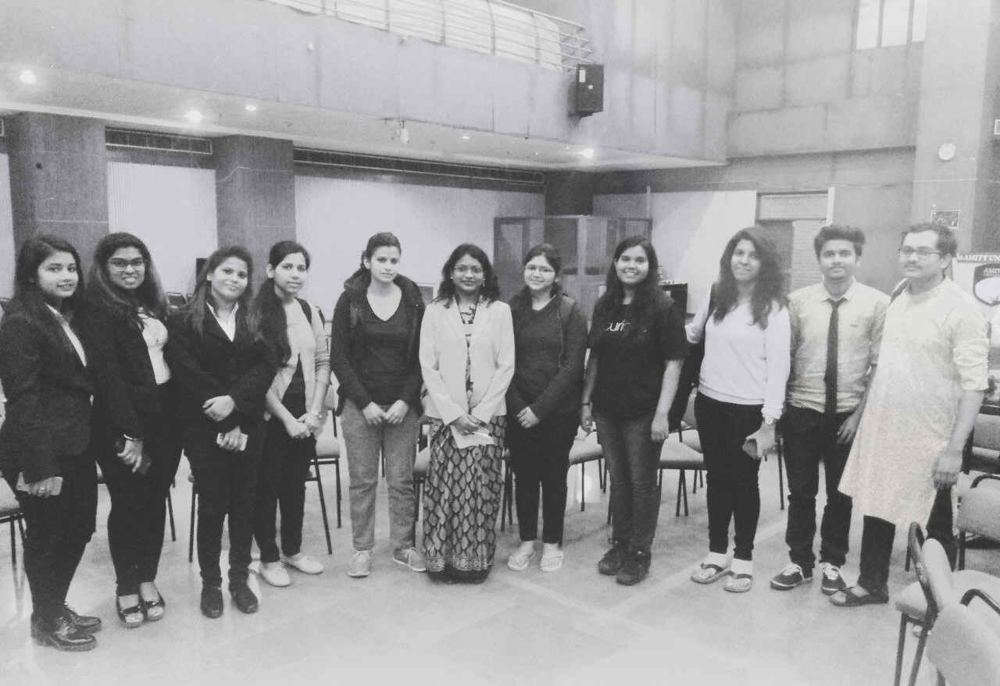
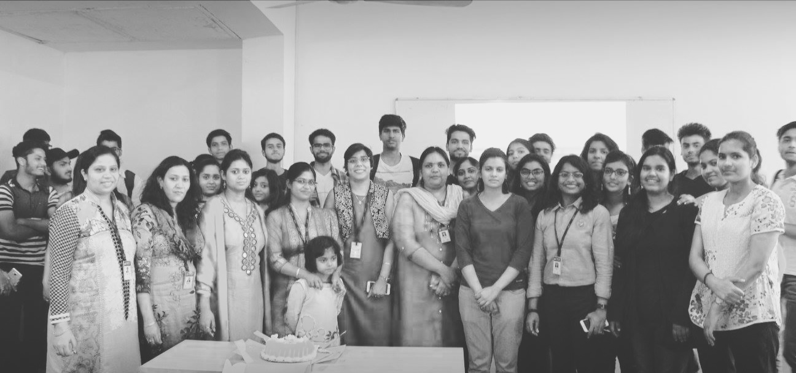

import { OrganisationBlock } from '@sawatdeehaneu/docusaurus-theme';

# Mentorship
Mentoring is the structured transfer of practical wisdom and experience to foster development.

## AI Hackathon @ Berkeley

#### About the initiative

<OrganisationBlock 
    name="Cal Hacks @ Berkeley"
    logoLight="https://ai.hackberkeley.org/_next/static/media/logo.de9dbd92.png"
    logoDark="https://ai.hackberkeley.org/_next/static/media/logo.de9dbd92.png"
    description="[Hackathons @ Berkeley](https://hackberkeley.org/) is a non-profit organization responsible for Cal Hacks, the world's largest collegiate hackathon which annually convenes innovators to explore technological boundaries."
    socials={[
        { name: 'Website', link: 'https://hackberkeley.org/' },
        { name: 'Twitter', link: 'https://twitter.com/CalHacks' },
    ]}
/>

#### Contribution

As a mentor at the AI Hackathon, I provided technical guidance and strategic feedback to competing teams, helping them refine their concepts and implement functional solutions within the event timeline.

## Girl Tech Power 

#### About the initiative

<OrganisationBlock 
    name="Girl Tech Power"
    logoLight="https://pbs.twimg.com/profile_images/629735945139458048/b3AJOa5H_400x400.png"
    logoDark="https://pbs.twimg.com/profile_images/629735945139458048/b3AJOa5H_400x400.png"
    description="[Girl Tech Power](https://girltechpower.cs.usfca.edu/) is a summer code camp at the University of San Francisco designed to empower middle and high school girls to join the tech industry. Directed by Professor Alark Joshi and funded by Craig Newmark Philanthropies, the program concludes with a visit to a Bay Area tech company, where participants meet female engineers and present their final projects."
    socials={[
        { name: 'Website', link: 'https://girltechpower.cs.usfca.edu/' },
        { name: 'Twitter', link: 'https://x.com/girltechpower' },
    ]}
/>

#### Contribution

As a Girl Tech Power leader, I directed initiatives to teach middle and high school girls foundational Python coding, with a final project of building a functional game. To build community, each class concluded with Disney trivia. Participant feedback highlighted the supportive environment and the valuable technical skills acquired.

 
|  |  | 
|-|-|
|  |  |

## Exercism

#### About the organisation

<OrganisationBlock 
    name="Exercism"
    logoLight="https://assets.exercism.org/assets/icons/exercism-with-logo-black-12752bd7fcf6862ba8ad7a2b75e21a9b2409d7fd.svg"
    logoDark=""
    description="[Exercism](https://exercism.org/) is an online, open-source, free coding platform designed to help enhance coding skills through practice and mentorship on 70 programming languages and 5989 coding exercises. 
    \
    7.3K stars. 4.9K followers."
    socials={[
        { name: 'GitHub', link: 'https://github.com/exercism' },
        { name: 'Website', link: 'https://exercism.org/' },
        { name: 'Twitter', link: 'https://twitter.com/exercism_io' },
        { name: 'Wiki', link: 'https://en.wikipedia.org/wiki/Exercism' },
    ]}
/>

#### Contribution

As a mentor, I provided feedback and answered questions to help students improve their coding skills in Python and JavaScript, and learn new programming concepts.

## ALiAS - Amity Linux Assistance Sapience

#### About the organisation

<OrganisationBlock 
    name="ALiAS"
    logoLight="https://avatars.githubusercontent.com/u/20925586?s=280&v=4"
    logoDark="https://avatars.githubusercontent.com/u/20925586?s=280&v=4"
    description="[ALiAS](https://asetalias.in/) is a student-led organization cum tech community that fosters open-source culture, the use of Linux and the culture of hacking and sharing."
    socials={[
        { name: 'GitHub', link: 'https://github.com/asetalias' },
        { name: 'Website', link: 'https://asetalias.in/' },
        { name: 'LinkTree', link: 'https://linktr.ee/asetalias' },
        { name: 'Twitter', link: 'https://twitter.com/asetalias' },
        { name: 'LinkedIn', link: 'https://www.linkedin.com/company/asetalias/' },
    ]}
/>

#### Contribution

As President and a founding member, I guided newcomers through the contribution process, organized weekly meetings, led technical sessions, and established study groups. I also founded the 'Women in Tech' initiative, organizing workshops and events to promote greater participation in the industry.

|  |  |
|-|-|

:::note[[Read more about my journey with ALiAS](../industry/alias)]
:::