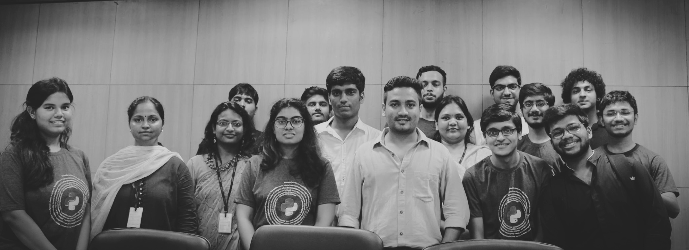
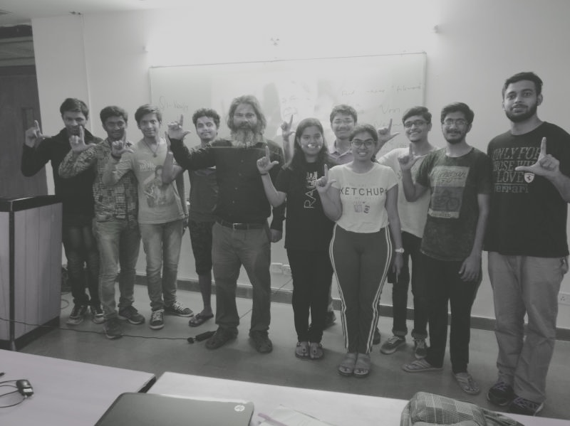
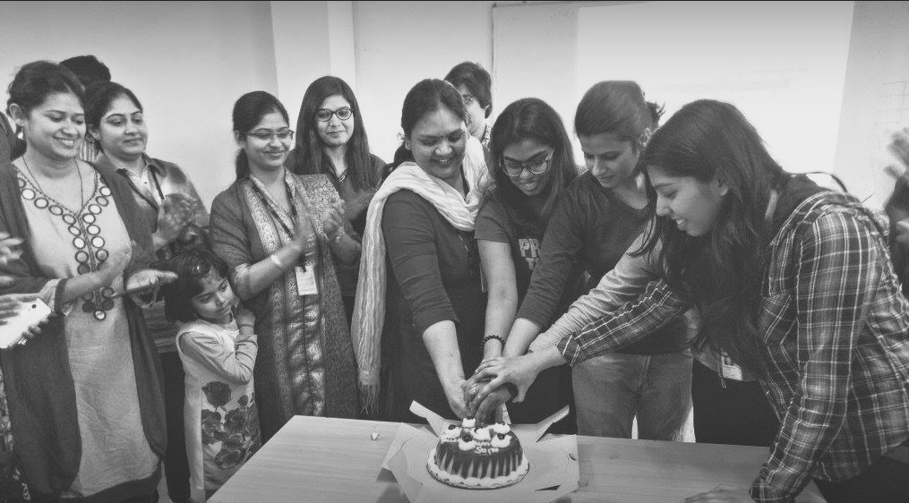
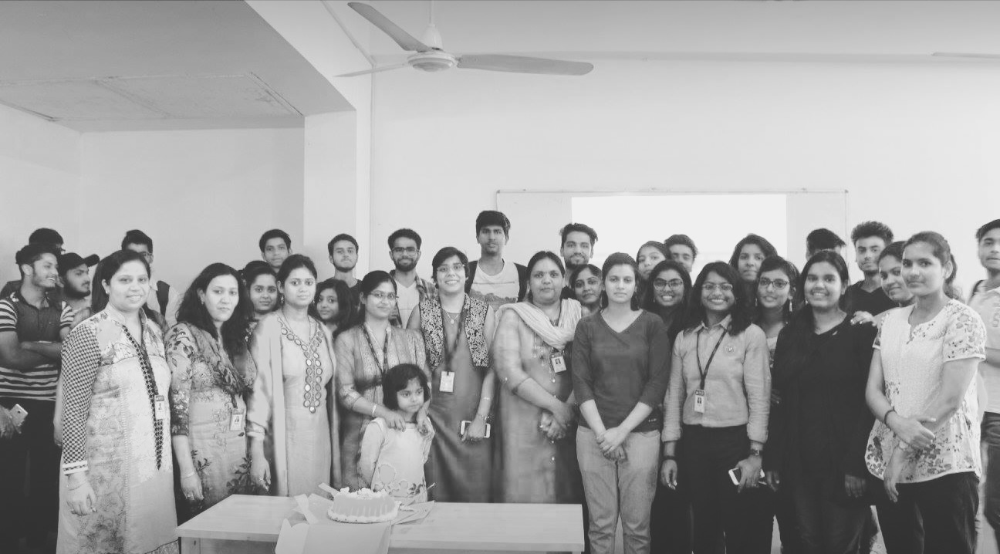
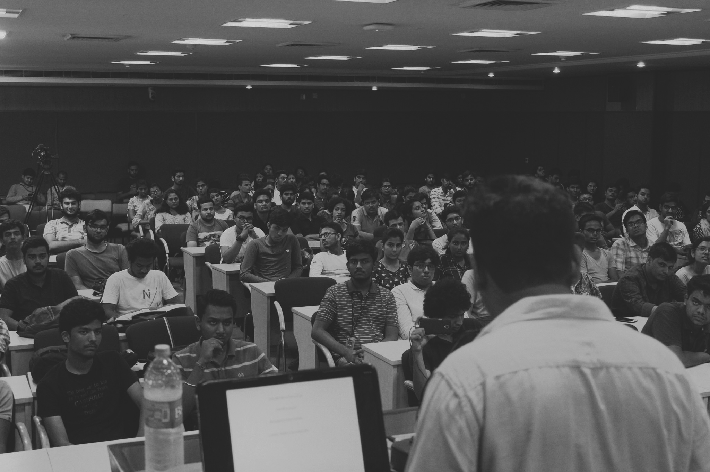

# ALiAS 
## Our vision

ALiAS, also known as the Amity Linux Assistance Sapience, is a community of like-minded 
individuals who share a common passion for Linux and open-source software. The community was 
established in Amity University, Noida, inclusive for everyone to join and contribute to the
open-source ecosystem. Our vision was to create an accessible space where computer scientists 
could collaborate on projects, share knowledge, and grow both individually and as a community.

## Inception

### A Community Born from Necessity

My journey with ALiAS began in the fall of 2016, just after I started my university life. 
Amidst the plethora of clubs sponsored by tech giants like Microsoft and Mozilla, which had 
veered into the administrative bureaucracy of university events, none seemed to 
truly cater to the core interests of a budding computer scientist. 

I was determined to create a community that was inclusive, where everyone had a voice and
could contribute to the community in their own way. During this time, I met Shyam Saini and 
Shivam Rajput, who shared my vision. Together, we set out to revive ALiAS. 
Our initial small scaled events, introduced us to Ayush Agarwal, Ajay Tripathi, Omkar Yadav, 
Anuja Agarwal, Parth Sharma and Vipul Gupta with whom we formed the founding members of the 
community. 

## Roles and Responsibilities
Behind every successful community lies a strong team. Although on paper, we assigned 
presidential roles in ALiAS, in practice, we removed hierarchical barriers, allowing each 
member to contribute their unique skills. We carefully divided our roles to leverage our 
individual strengths effectively:

- Shyam and Shivam upheld the community's vision and ethos in their leadership roles.
- I fostered a welcoming and inclusive environment through formal communications and 
community building.
- Ayush and Ajay ensured our projects were both innovative and technically sound through 
their code maintenance and development efforts.
- Omkar orchestrated the smooth execution of our numerous gatherings by managing logistics 
and event planning.
- Parth ensured our knowledge was accessible to all through his focus on design, 
content creation, and documentation.
- Anuja and Vipul expanded our network and support system through community outreach and 
mentorship.

This strategic distribution of responsibilities has allowed ALiAS to grow and thrive, with 
each area receiving the focused attention it requires.

## Growth and Milestones

From small workshops to large-scale annual events like Hacktoberfest, our activities were 
designed to nurture skills and knowledge. Some of those included:

- Monthly Linux Installation Fest: Introducing students to Linux, assisting them in 
installation, and familiarizing them with this powerful OS.
- Daily Tech Meetups: Discussing the latest technological advancements and sharing 
insights within our community.
- Community Calls: Planning the trajectory of ALiAS to continually improve and expand our 
reach.
- Specialized Study Groups: Offering support in various domains such as frontend development 
and machine learning, facilitated by peers and faculty.
- Annual [Hacktoberfest](https://hacktoberfest.digitalocean.com/) events where we would 
introduce students to the world of open-source and help them make their first contributions.

Our efforts have not only structured the community but also empowered other students to lead 
and share their expertise, fostering a cycle of learning and mentorship.

Amidst all of these and other events that we organised to include experts from the industry,
we also started a blog where we would share our knowledge and experiences with the world. 
These led us as a group to not only meet with great like-minded students, but also with 
faculty members across different departments that shared our hunger for knowledge, 
especially with computer systems.

### Linux Study Group by Prof. Priya Ranjan 

One such faculty member was Prof. Priya Ranjan who was a professor in the Electrical and
Electronics department. He was a Linux enthusiast since decades of his career and had been 
organising Linux study groups for students on the weekends. We were amazed by the depth of 
knowledge he had and his ability to explain complex concepts in simple terms. He believed 
that the best innovation comes from the simplest of ideas.

## Overcoming Challenges

Our journey has not been without obstacles. From navigating university bureaucracy to 
engaging a broader student base in open-source contributions, each challenge has been a 
learning opportunity. These experiences have strengthened our resolve and sharpened our 
focus on making knowledge accessible to all.

### Bridging Gaps
#### Enhancing Women's Participation in Tech
Despite our growth, the gender ratio within tech remained skewed. Anuja and I made only
25% of the founding members, and we realised that we had limited participation by the 
women. To address this, we initiated targeted workshops and events, like our Women's Day 
tech talks featuring prominent figures like Shivani Bhardawaj of LinuxChix India. 

|  |  |
|-|-|

I also started a mentorship program where I would mentor women personally to help them 
choose their career paths and understand the tech world better. These efforts 
significantly boosted female participation, enriching our community with diverse 
perspectives.

## Impact

I believe it is the resilience and impact we made, which led to key changes at the 
university, such as the introduction of Python in our courses and the recognition of 
ALiAS as the most active tech club and community on campus.

### Expansion
#### The Rise of ALiAS Chapters

The success and impact of ALiAS at Amity University inspired students from other 
institutions to establish their own chapters. Beginning with the establishment of a 
chapter at Amity University, Lucknow, we provided guidance and resources, helping them 
adopt our model of open-source advocacy and community-driven learning, spreading the 
ethos of ALiAS across India.

## Looking Ahead

Today, ALiAS boasts over 2000 members across multiple chapters, with students actively 
contributing to major open-source projects and engaging at local and international tech 
conferences. Our mentorship programs and innovative events like GSoC AMA sessions 
continue to guide new generations of tech enthusiasts.

## Reflection

Reflecting on this incredible journey, I see how our commitment to 'exploration, 
innovation, and community' in Computer Science has not only enriched my own 
understanding but has also fostered a supportive network of passionate technologists.