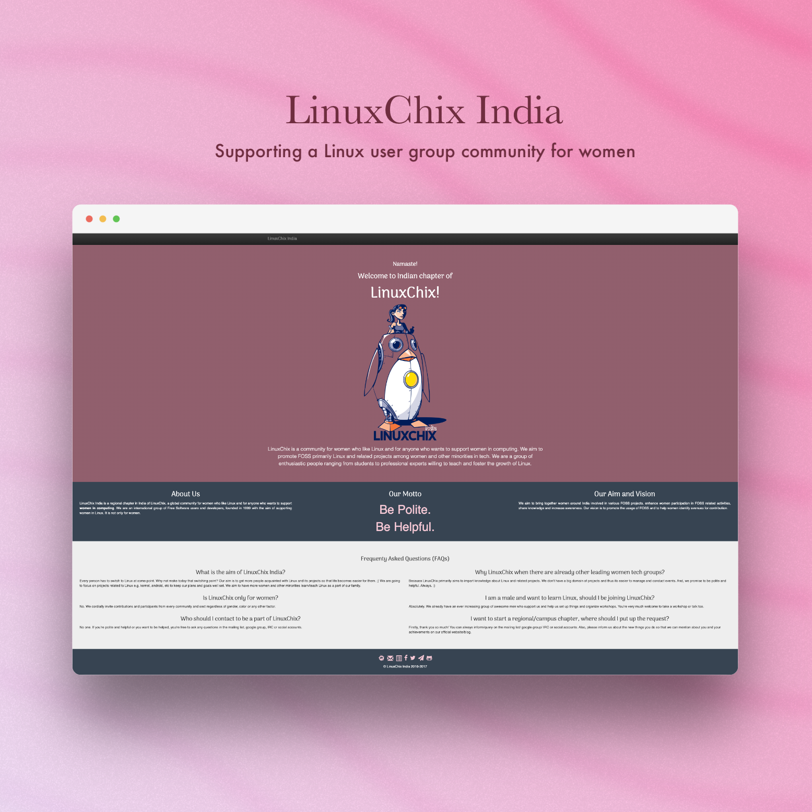

import { OrganisationBlock } from '@sawatdeehaneu/docusaurus-theme';

# Open Source Software

In open-source software, I contribute to fortify the ecosystem by supporting projects through issue resolution, documentation, and code. 
My work aims to share knowledge and empower users. 

Key projects include:

## Pandas

#### About the organisation

<OrganisationBlock
    name="Pandas"
    logoLight="https://upload.wikimedia.org/wikipedia/commons/thumb/e/ed/Pandas_logo.svg/1280px-Pandas_logo.svg.png"
    logoDark=""
    description="[Pandas](https://pandas.pydata.org/) is a software library written for the Python programming language for data manipulation and analysis. It is designed to handle the dirty work of data preparation and transformation that is often required before statistical analysis can be performed.
    \
    Used by 1.7M repositories. 42.2K stars."
    socials={[
        { name: 'GitHub', link: 'https://github.com/pandas-dev' },
        { name: 'Website', link: 'https://pandas.pydata.org/' },
    ]}
/>

#### Contribution

I enhanced documentation and conducted data analysis to improve the tool's accessibility for a global developer audience.

## LinuxChix India

#### About the organisation

<OrganisationBlock
    name="LinuxChix India"
    logoLight="https://avatars.githubusercontent.com/u/24838409?s=280&v=4"
    logoDark="https://avatars.githubusercontent.com/u/24838409?s=280&v=4"
    description="[LinuxChix India](http://india.linuxchix.org/) is a non-profit organization for the Linux user groups in India, passionate about sharing knowledge and learning. It aims to promote gender diversity in Free and Open Source Software (FOSS) communities in India."
    socials={[
        { name: 'GitHub', link: 'https://github.com/linuxchixin' },
        { name: 'Website', link: 'http://india.linuxchix.org/' },
    ]}
/>

#### Contribution

I developed the website from the ground up as part of a redesign initiative, optimizing all pages for mobile responsiveness and accessibility.

 

## ALiAS - Amity Linux Assistance Sapience

#### About the organisation

<OrganisationBlock 
    name="ALiAS"
    logoLight="https://avatars.githubusercontent.com/u/20925586?s=280&v=4"
    logoDark="https://avatars.githubusercontent.com/u/20925586?s=280&v=4"
    description="[ALiAS](https://asetalias.in/) is a student-led organization cum tech community that fosters open-source culture, the use of Linux and the culture of hacking and sharing."
    socials={[
        { name: 'GitHub', link: 'https://github.com/asetalias' },
        { name: 'Website', link: 'https://asetalias.in/' },
        { name: 'LinkTree', link: 'https://linktr.ee/asetalias' },
        { name: 'Twitter', link: 'https://twitter.com/asetalias' },
        { name: 'LinkedIn', link: 'https://www.linkedin.com/company/asetalias/' },
    ]}
/>

#### Contribution

As a repository maintainer, I contributed to website development, documentation, and the creation of logistical systems for administrative and event management. I also assisted with social media strategy and developed a mobile application in Summer 2018.

:::note[[Read more about my journey with ALiAS](alias)]
:::