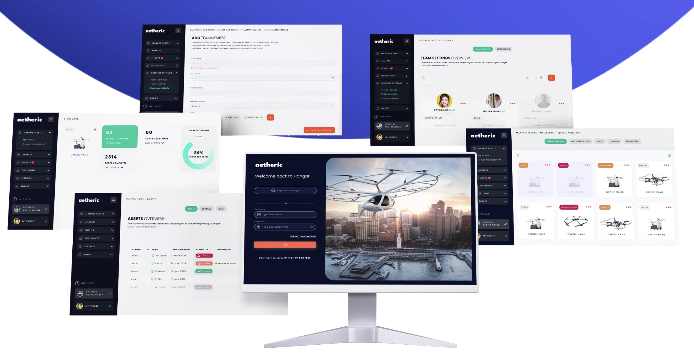

import { OrganisationBlock } from '@sawatdeehaneu/docusaurus-theme';

# Tech

My journey in technology is driven by my passion for making a tangible impact through 
innovative solutions. Each role I've undertaken has not just been a job, but a chapter 
in my story of transforming challenges into opportunities, with a steadfast commitment 
to enhancing life through technology.

Here, are some of my significant experiences highlighted below:

{/*  */}

## Gen AI software engineer at AAA

#### About the organisation

<OrganisationBlock 
    name="AAA - The Auto Club Enterprises"
    logoLight="https://upload.wikimedia.org/wikipedia/commons/thumb/d/d4/American-Automobile-Association-Logo.svg/1200px-American-Automobile-Association-Logo.svg.png"
    logoDark=""
    description="[American Automobile Association (AAA)](https://aaa.com/) is a federation of motor clubs throughout North America. AAA is a privately held not-for-profit national member association and service organization with over 60 million members in the United States and Canada."
    socials={[
        { name: 'Website', link: 'https://aaa.com/' },
    ]}
/>

#### The work
**The Objective**: Architect and deploy Gen AI systems that deliver transformative, scalable value 
in solving complex real-world problems by building intelligent, efficient, and reliable agentic 
infrastructure and workflows.

**The Role**: Led the end-to-end development of AAA's core AI products. Architected scalable multi-agent systems, optimized RAG and 
fine-tuning pipelines, and collaborated cross-functionally to turn cutting-edge research into production-ready solutions that serve a 
massive user base.

**The Impact**: Drove the development and scalablity of AAA's flagship Gen AI Roadside Assistance to 60,000 daily active users. 
Built the core web app, model evaluation platform and agentic orchestration infrastructure powering all GenAI products. 
Shipped a fleet of AI agents that autonomously manage critical workflows, delivering precision and efficiency across 
the entire user base.

## Gen AI developer at Object Edge 

#### About the organisation

<OrganisationBlock 
    name="Object Edge"
    logoLight="https://assets-global.website-files.com/5c6acd483ca6bdd37537fd4c/62e256e8bdc1fb0c6d156f57_Header%20logo%402x.webp"
    logoDark=""
    description="[Object Edge](https://www.objectedge.com/) is an award-winning consultancy that designs, implements and manages eCommerce in B2B and B2C. It was the *Master's Thesis Sponsor* for this project."
    socials={[
        { name: 'Website', link: 'https://www.objectedge.com/' },
    ]}
/>

#### The work

:::note[Project Overview]
Auto Integrate is a pivotal advancement in data integration, providing scalable solutions 
that minimize manual efforts and enhance data reliability. 

{/* *Read more on the project [here](projects/auto-integrate.md).* */}

:::

**The Vision**: The goal was to create a scalable solution that minimized manual data handling 
and increased data reliability through automation.

**My Contribution**: I designed and developed the LLM-driven multi-agent AI frameworks 
that helped us develop an advanced ETL tool to automate API integration processes across multiple 
platforms.

**The Outcome**: The project surpassed its initial proof of concept, demonstrating our ability to 
handle complex, multi-platform data integrations. This work not only set new industry standards 
but also showcased our capability to innovate and lead in the tech space.

## Staff Software Enginer at Arrow Air

#### About the organisation

<OrganisationBlock 
    name="Arrow Air"
    logoLight=""
    logoDark="https://assets-global.website-files.com/639a2d8db0ff26e6ca7a68ff/639b4d564b6eae570db90e0b_arr_logo-nav.svg"
    description="[Arrow Air](https://www.arrowair.com/) DAO is a decentralized community building vertical-takeoff and landing vehicles (VTOLs) along with the services and infrastructure to transport people and goods. The open source AAM ecosystem for flight planning and VTOL asset management is now an independent organisation named [aetheric](https://www.aetheric.nl/), based in Netherlands."
    socials={[
        { name: 'Website', link: 'https://www.arrowair.com/' },
        { name: 'GitHub', link: 'https://github.com/Arrow-air' },
        { name: 'LinkedIn', link: 'https://www.linkedin.com/company/arrowair' },
    ]}
/>

#### The work

**The Mission**: To revolutionize the user experience for VTOL logistics by building an intelligent,
AI-native platform from the ground up.

**My Strategy**: Led full-stack development, architecting a Gen AI-powered web app with a React frontend
 and a Python backend featuring a RAG pipeline (OpenAI, Pinecone).

**The Results**: Engineered the full stack web app, for accurate, real-time intelligence. Delivered a high 
performance app with sub-1.5s FCP and enhanced user personalisation and operational efficiency by shipping 
a core AI feature.

## Senior Software Engineer at Prismberry Technologies

#### About the organisation

<OrganisationBlock 
    name="Prismberry"
    logoLight="https://prismberry.com/wp-content/smush-webp/2024/04/prismberry.png.webp"
    logoDark="https://prismberry.com/wp-content/smush-webp/2024/04/prismberry.png.webp"
    description="[Prismberry](https://prismberry.com/) is a consultancy service provider in software design and development focused on Artificial Intelligence, Product Engineering, Cloud Technologies, Data Analytics, Mobile Application, Automation, DevOps etc."
    socials={[
        { name: 'Website', link: 'https://prismberry.com/' },
        { name: 'LinkedIn', link: 'https://www.linkedin.com/company/prismberry-technologies' },
    ]}
/>

#### The work

**The Objective**: Ensuring all teams across the company produce
high-quality deliverables for our clients, notably Flipkart. As a senior software engineer,
I was responsible for the entire software development lifecycle, from requirements gathering
to deployment. 

**My Role**: I spearheaded an overhaul of the NLP systems and 
backend processes, integrating cutting-edge BERT models and optimizing SQL queries. My initial 
project involved training Transformer models from scratch on a custom language dataset, 
and to deploy them on a production server. Later on, I worked on various products that drove 
ecommerce for various companies in India and abroad.

**The Impact**: My efforts significantly enhanced the reliability 
of our software, improving overall customer satisfaction and streamlining operations. 
These efforts include:

- Increased NLP accuracy by 20% with new language BERT models on RTX 3080Ti GPUs.
- Boosted user engagement 25% by revamping e-commerce backend with Stripe & audio processing. 
- Cut SQL query time 93%, from 15s to less than 1s, optimizing site performance.
- Enhanced software reliability 15% via test-driven development and code maintenance.

## Senior Software Engineer at Essentia.dev

#### About the organisation

<OrganisationBlock 
    name="Essentia.dev"
    logoLight="https://essentia.dev/images/logo.svg"
    logoDark=""
    description="[Essentia.dev](https://essentia.dev/) is an IT software solution provider based in Delhi, India."
    socials={[
        { name: 'Website', link: 'https://essentia.dev/' },
        { name: 'LinkedIn', link: 'https://www.linkedin.com/company/essentia-dev/about/' },
    ]}
/>

#### The work

**The Challenge**: Essentia.dev faced challenges with project timelines and system inefficiencies 
that affected client satisfaction and operational costs.

**My Contributions**: as a Senior Software Engineer:

- Spearheaded the integration of automation and agile practices to streamline development 
processes, significantly reducing bottlenecks.
- Engineered and implemented robust database architectures across diverse tools, and developed 
from scratch a comprehensive payment system to boost transaction success rates.
- Took up the responsibilities of a developer relations manager, liaising directly with clients 
to tailor solutions to their needs, and guided cross-functional teams by instilling best practices.
- Actively represented the company at major industry conferences across India, enhancing our 
corporate profile and engagement with the tech community.

**The Results**: 
- Delivered a project that saved over $9,000—an amount significant enough to cover multiple 
developers’ salaries for three months in India—cut project timelines by 40%, and lifted client 
satisfaction by 15%.
- Mentored a team of 10 trainees, improving our task completion rate by 10%, which underscored 
my dedication to team development and project excellence.

## Full Stack Developer at Letstream

#### About the organisation

<OrganisationBlock 
    name="Letstream"
    logoLight="https://www.theletstream.com/assets/img/logo/logo.png"
    logoDark=""
    description="[Letstream®](https://www.theletstream.com) is a dynamic IT consulting, development, and marketing company based in Noida, Uttar Pradesh, India."
    socials={[
        { name: 'Website', link: 'https://www.theletstream.com/' },
        { name: 'LinkedIn', link: 'https://in.linkedin.com/company/letstream' },
    ]}
/>

#### The Work

**The Task**: To manage end-to-end development of web and mobile applications, ensuring robust, 
scalable, and efficient software solutions.

**My Approach**: I took charge of designing, developing, testing, deploying, and maintaining 
comprehensive software systems, collaborating closely with cross-functional teams to ensure 
precise requirement implementation and system reliability.

**The Achievement**: My leadership in these projects not only streamlined development processes 
but also fostered a culture of innovation and agility within the team.

