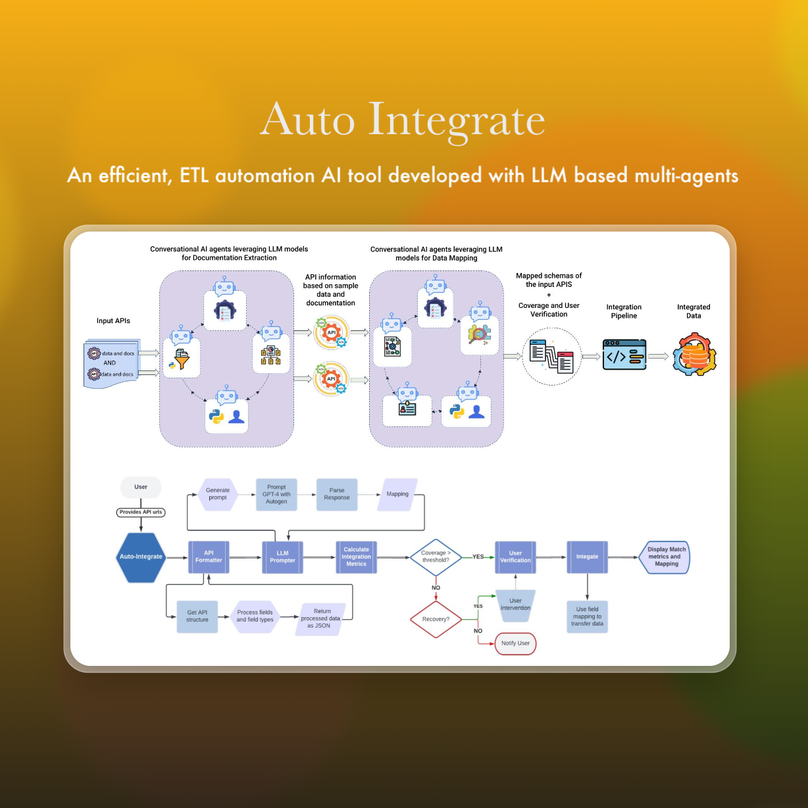
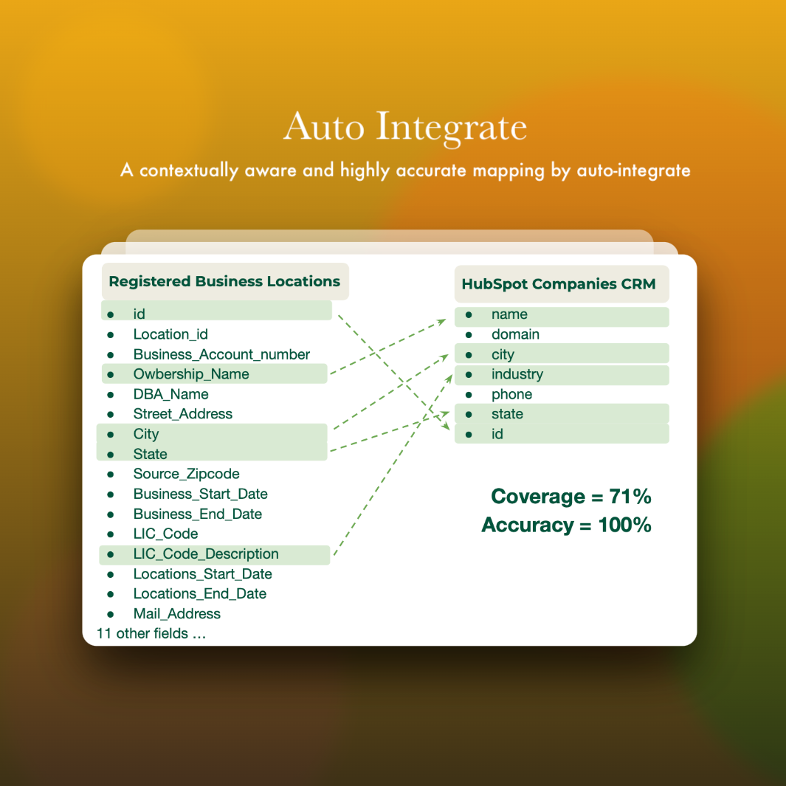
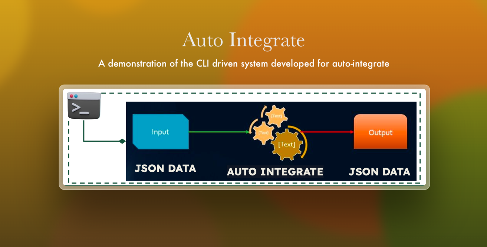

# Auto-Integrate

**Team**: Tanya Jain, Adi Kunatharaju  
**Sponsor**: Jags Krishnamurthy @ Object Edge  
**Institution**: University of San Francisco

 

## Project Description
Auto Integrate streamlines data integration across systems using a command-line interface, aiming to save significant analyst and developer hours currently wasted on manual data mapping. This project enhances both efficiency and accuracy through automation.

## Objectives
- **Time Efficiency**: Minimize the manual data exchanges between systems, which is crucial in today's digital age.
- **Automation**: Automate the data integration process to streamline operations and reduce the potential for human error.
- **Proof of Concept**: Validate the feasibility of ETL integration between SF Open Dataset and HubSpot CRM, laying the groundwork for broader automated data integration applications.

## Challenges and Initial Research
The project addresses key challenges with various data types and complex relationships like many-to-one and one-to-many, the team assessed models including GPT-3.5, GPT-4, Llama-2, WizardLM, and Vicuna to optimize task accuracy and coverage.

## Technology and Methodology
The core of the project is the Auto Integrate CLI, a class-based modular structure designed for robustness and easy management of tasks:

- **Tech Stack**: Python, JSON, and various APIs (including MockAPI for testing).
- **API Mapping and Transformation**: Supports complex mappings, type transformations, and seamless data integration across platforms.
- **Custom Multi-Agent Frameworks**: Leverages GPT-4 models to extract API information from documentation and to map APIs effectively.

<!-- ## Progress and Current Capabilities
- **User Interface**: Command Line Interface for straightforward interaction.
- **Data Handling**: Capable of parsing JSON files, extracting and logging information, and maintaining a pipeline for data once mapping is complete.
- **Model Implementation**: Demonstrated use of LLM models for documentation extraction and data mapping, with features supporting complex mappings like many-to-one and one-to-many relationships.
Key Outcomes
- **Model Performance**: The Llama2-70B model showed 100% coverage with 42% accuracy, indicating potential areas for enhancement.
- **Mock API Testing**: Demonstrated effective mapping with a coverage of 71% and accuracy of 100% in a simulated environment. -->

## System Architecture
The "Auto Integrate" project is built on a sophisticated and modular system architecture that ensures flexibility, robustness, and scalability. It is structured as follows:

- **Client Interface**: A Command Line Interface (CLI) allows users to directly interact with the system.
- **Data Handling Layer**: This layer manages the data input/output operations, including parsing JSON files and logging activities. It handles the formatting of data from API documentation for reliable mapping.
- **Integration Layer**: Utilizes GPT-4 models within a custom multi-agent framework for core mapping functionalities. It includes conversational AI agents that extract necessary API information and perform complex data mappings.
- **Security and Compliance Layer**: Plans for future enhancements include secure API interactions.

 

## Key Features and Innovations
The "Auto Integrate" project introduces several key features and innovations that set it apart in the field of data integration:

- **Modular Structure**: The class-based, modular structure of the system allows for isolated task management, enhancing maintainability and scalability.
- **Advanced Mapping Capabilities**: Supports complex data type transformations and data relationships, including many-to-one, one-to-many, lists, and objects.
- **Custom Multi-Agent Frameworks**: Utilizes state-of-the-art conversational AI technology leveraging GPT-4 to automate and refine the extraction and mapping processes. These frameworks enhance the accuracy and efficiency of the integration process.
- **Dynamic Data Flow**: The system can GET data from one API, transform and map the fields as required, and POST it to another API, facilitating a seamless data flow across platforms.

## Impact and Significance
Auto Integrate significantly reduces the effort required for data mapping, thereby enhancing data accuracy and supporting digital transformation. Its modular architecture adapts to evolving business needs, demonstrating considerable potential in revolutionizing data integration practices.

:::tip[Exceeding Initial Goals]
Initially, the proof of concept was intended to demonstrate the feasibility of ETL integration between SF Open Dataset and HubSpot. However, our project achieved much beyond that, showcasing the capability to handle complex, multi-platform data integration and transformation, thus setting new standards in the field.
:::

## Future Directions
- **Enhanced Reliability**: Address limitations such as hallucinations and increase structural and mapping reliability by using multiple agents.
- **API Security**: Implement functionality to handle authentication tokens required for API interactions.
- **Real World Testing**: Further testing with real-world APIs to determine the robustness and practicality of the tool.

## Conclusion
Auto Integrate is a pivotal advancement in data integration, providing scalable solutions that minimize manual efforts and enhance data reliability. As the project evolves, it continues to refine its capabilities, addressing the dynamic demands of modern data systems.
