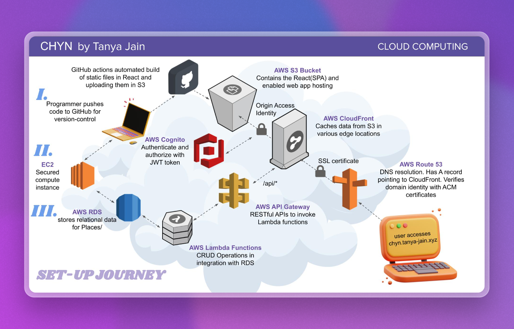
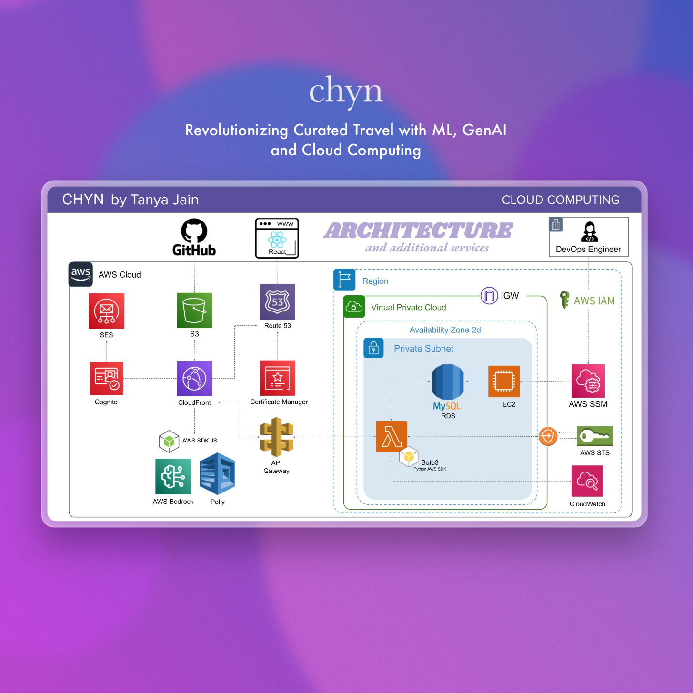

# CHYN by Tanya Jain

## Revolutionizing Curated Travel with Cloud Computing

**Team**: Tanya Jain  
<!-- **Presentation**: Cloud Computing -->

## Project Description
CHYN, derived from the Hindi word चयन (chayan), meaning 'to select' or 'curate', is a cloud-based platform designed to make curated travel more accessible. Utilizing advanced Machine Learning (ML) technologies, CHYN fills significant gaps in the oversaturated travel market, focusing on providing a highly personalized and accessible daily travel experience.

 

## Motivation
The project was inspired by the need to streamline the curated travel experience, making it more accessible and tailored through the use of cutting-edge ML technologies. CHYN aims to simplify the process of travel planning by automating the curation based on individual preferences and insights derived from vast amounts of travel data.

## System Architecture
CHYN leverages a robust cloud-based architecture to deliver its services:

- **Frontend**: Utilizes React (switched from Vue3 for better static file generation).
- **Hosting**: AWS S3 bucket hosts the SPA, enabling web app hosting with automated builds and deployments via GitHub Actions.
- **Security and Access**: Managed through AWS Route 53 for DNS resolution, AWS CloudFront for content delivery, and SSL certificates for secure user access.
- **Authentication**: AWS Cognito is used for secure user authentication and authorization with JWT tokens.
- **Backend Processing**: AWS Lambda functions handle CRUD operations, integrated with AWS RDS for relational data storage.

 

## Key Technologies and Innovations
- **AWS Polly**: Enhances accessibility by converting text to audio, aiding travelers who prefer audio guides or are visually impaired.
- **AWS Bedrock x Claude**: Employs LLM models to extract noteworthy places and details from textual content, making it easier for users to bookmark places from blogs and articles.

## Challenges
- Managing S3 bucket configurations and ensuring that bucket names match the desired domain names.
- Handling AWS Security Token Service (STS) for secure role assumption by IAM users.
- Addressing common issues like 404 NotFound errors for misconfigured endpoints.

## Impact and Significance
CHYN significantly impacts the travel industry by providing a platform that not only simplifies the travel planning process but also enhances the accessibility and personalization of travel experiences. It addresses key challenges in curated travel, such as the need for personalized recommendations and the ability to seamlessly integrate travel insights and preferences.

## Limitations
- The application currently operates with a limited scope, primarily focusing on San Francisco.
- Privacy considerations prevent the use of background tracking, limiting real-time data gathering.
- Distances between locations are calculated as the crow flies, which may not always reflect actual travel distances.

## Conclusion
CHYN has successfully demonstrated how a range of AWS services can be integrated to build a comprehensive cloud-based solution for the travel industry. The project underscores the importance of security in cloud deployments and highlights the potential for cloud technologies to significantly enhance user experiences in web applications.

## Future Scope
- **Personalized Recommendations**: Introduce algorithms that tailor travel recommendations based on user behavior and past itineraries.
- **Social Sharing**: Develop features that allow users to share their travel plans with friends or on social media platforms.
- **Surprise Me Feature**: Implement an innovative feature that generates random but intriguing travel plans for users seeking spontaneous travel experiences.

