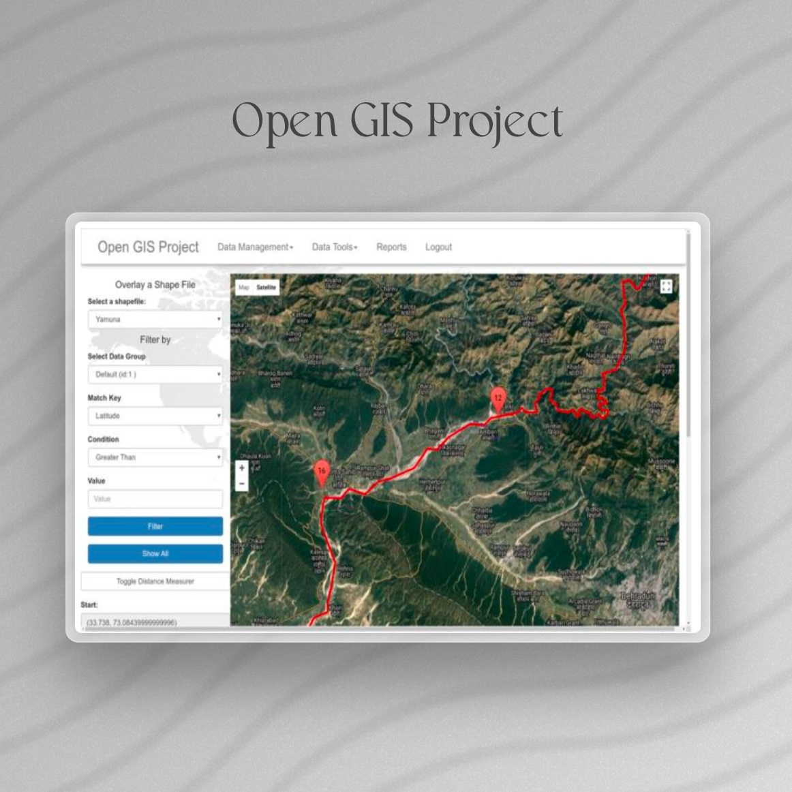
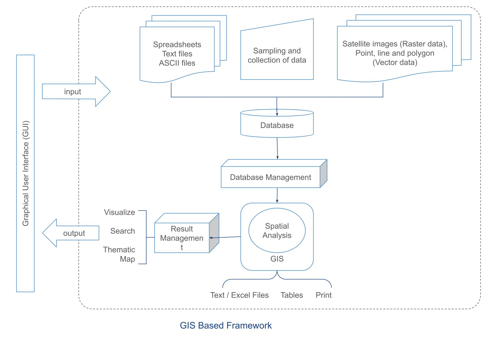
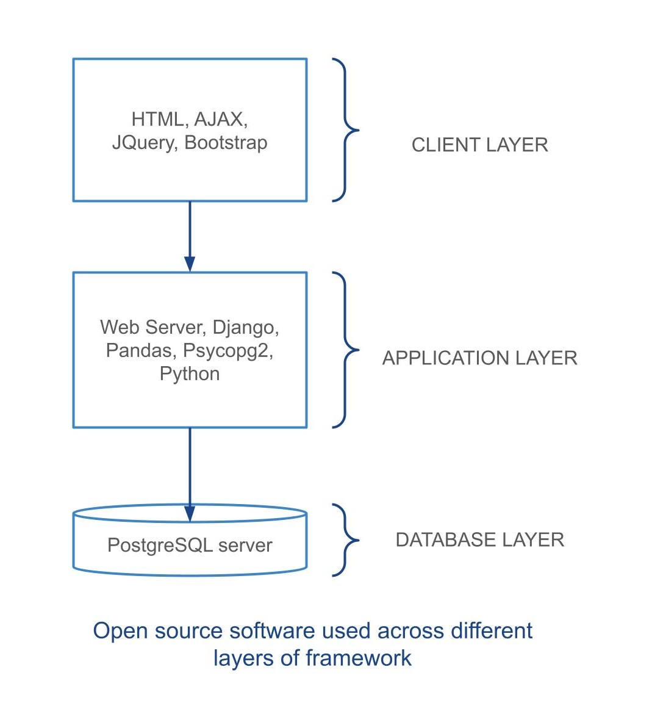
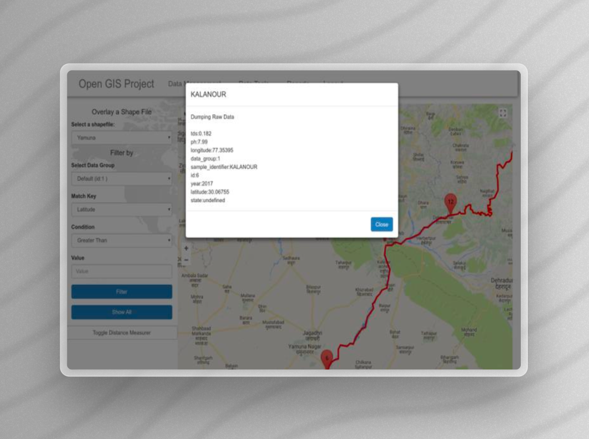

# Open GIS Project

## Real-Time GIS Framework for Environmental Monitoring
**Institution**: Amity University, Noida, India  
**Advisor**: Madhuri Kumari, Nitasha Hasteer

## Project Description
Developed a robust web-based Geographic Information System (GIS) leveraging open-source technologies to monitor environmental phenomena, such as river pollution levels. The solution integrates spatial data management across various geographic locations, providing a scalable and intuitive tool for environmental researchers and decision-makers.

## Objectives
 - Facilitate the real-time visualization and management of environmental data.
 - Employ cost-effective, open-source tools to ensure wide accessibility and adaptability.

## Comprehensive Technology Stack
 - **Frontend**: HTML, CSS, JavaScript, AJAX, jQuery, Bootstrap
 - **Backend**: Django, used for handling API requests, data management, and server-side logic.
 - **Database**: PostgreSQL, for secure and scalable data storage.
 - **GIS Tools**: QGIS, SAGA GIS for spatial data analysis and management.
 - **Data Analysis and Visualization**: Pandas for data handling and manipulation, Google Charts for creating dynamic, interactive graphical representations of data.

## System Architecture
The architecture is structured into three layers:

 - **Client Layer**: Employs AJAX and jQuery for responsive user interactions and real-time data updates.
 - **Application Layer**: Django serves as the backbone, managing authentication, database interactions, and API integrations.
 - **Database Layer**: Utilizes PostgreSQL to manage both spatial and non-spatial data efficiently.

 

## Key Features and Innovations
 - **Dynamic Data Visualization**: Interactive maps and graphs allow for comprehensive analysis and reporting of environmental data.
 - **Advanced Data Management**: Supports multiple data formats and facilitates seamless data input and manipulation through a well-designed GUI.
 - **Enhanced User Experience**: Features such as map zooming, shapefile overlaying, and real-time filtering enhance user interaction and data accessibility.

## Impact and Significance
This project supports critical environmental initiatives, such as the monitoring and management of river pollution. By leveraging advanced GIS capabilities and open-source technologies, the framework aids in making informed decisions that significantly impact community health and environmental preservation.

## Conclusion
This GIS framework demonstrates the power of integrating open-source technology with advanced data analysis tools to address environmental challenges. It is a pivotal solution for researchers and policymakers aiming to enhance environmental monitoring and decision-making processes.
