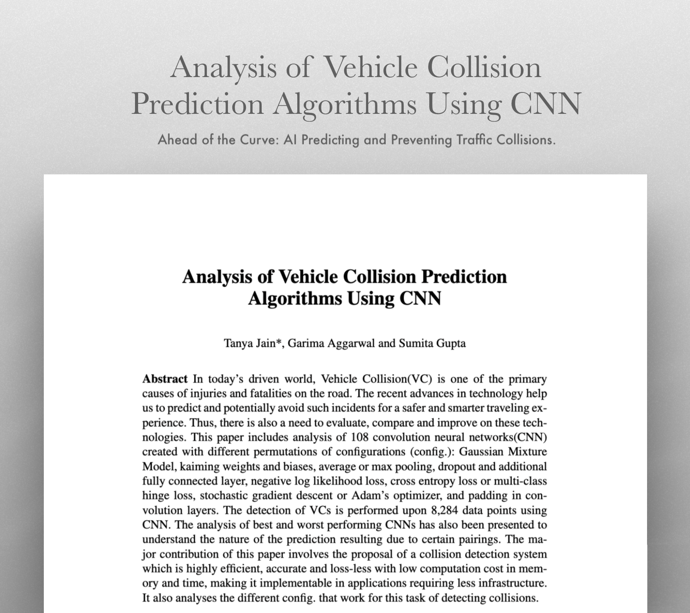
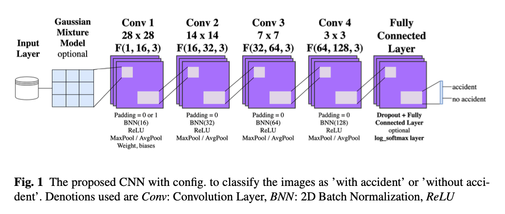
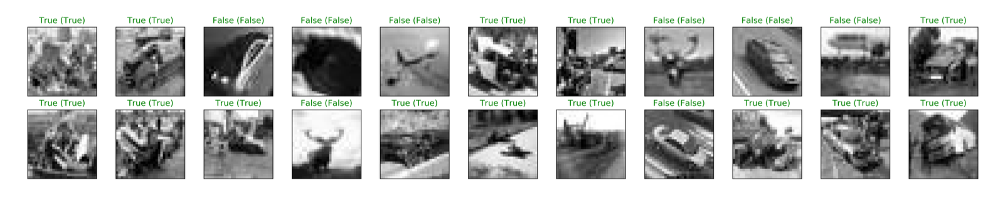

# Paper: Collision Detection

## Project Overview
This project explores groundbreaking advancements in vehicle collision prediction algorithms using convolutional neural networks (CNNs). Highly recognized among the top 20% of submissions at the ICDAM international conference, our research presents a comprehensive analysis of 108 CNN configurations, significantly enhancing autonomous vehicle safety by innovatively addressing real-world complexities.

 

## Objectives
### Develop a Highly Accurate System
Create a system that predicts vehicle collisions with high accuracy andminimal computational resources. This system aims to improve the reliability and responsiveness of autonomous vehicles in real-world conditions, ultimately enhancing road safety.

### Evaluation
Assess various CNN configurations on performance metrics such as accuracy, precision, recall, and F1-score. The goal is to identify optimal configurations that ensure the best balance between performance and computational efficiency, facilitating widespread adoption in the automotive industry.

## Methodology

The study involved creating and analyzing a substantial dataset of 8,284 data points and detailing the performance of various CNN configurations, examining aspects like accuracy, precision, recall, and F1-score. The detailed comparative analysis of various configurations -- including different layers, activation functions, optimizers, and loss functions, provides valuable insights into which combinations of techniques and optimizations yield the best results.

## Key Findings

The top-performing CNN configuration achieved 100% accuracy along with perfect precision, recall, and F1-score, demonstrating its capability to reliably predict vehicle collisions in complex environments.

This high accuracy, coupled with low computational demands, marks a significant step forward in making advanced autonomous driving technologies more practical and accessible.

## Key Challenges

### Data Limitations
Significant challenges arose from the restricted availability and variability of real-world collision data, which is crucial for training predictive models.

### Complexity in Prediction 
Object prediction in autonomous driving typically benefits from the recognizable and consistent structures of objects like cars and humans. However, collision scenarios often partially or completely deform these structures, complicating the prediction process. This deformation disrupts the basic geometric and visual cues that are essential for accurate recognition, presenting a unique and significant challenge for collision prediction systems.

### System Efficiency
Achieving high accuracy in collision prediction while maintaining computational efficiency was paramount, given the real-time operational needs of autonomous vehicles. This balance is crucial for the practical deployment of AI in dynamic environments, where both speed and reliability are critical.

## Impact
This research substantially advances the field of collision prediction algorithms, with significant implications for enhancing public safety and the operational efficiency of autonomous transportation systems. By improving the accuracy and reliability of such predictions, the technology can drastically reduce the incidence of road accidents, thereby saving lives and minimizing injuries.

## Future Work
The next phase will focus on integrating and testing these CNN configurations in real-world scenarios with diverse types of autonomous vehicles. This effort will aim to further refine the models to handle a variety of traffic conditions, improving the overall robustness and reliability of the collision prediction technologies.

## Conclusion
By setting new benchmarks in vehicle safety through innovative AI techniques, this project makes crucial contributions to enhancing global road safety. The distinguished recognition of our paper underscores the transformative impact and pioneering nature of our research.

